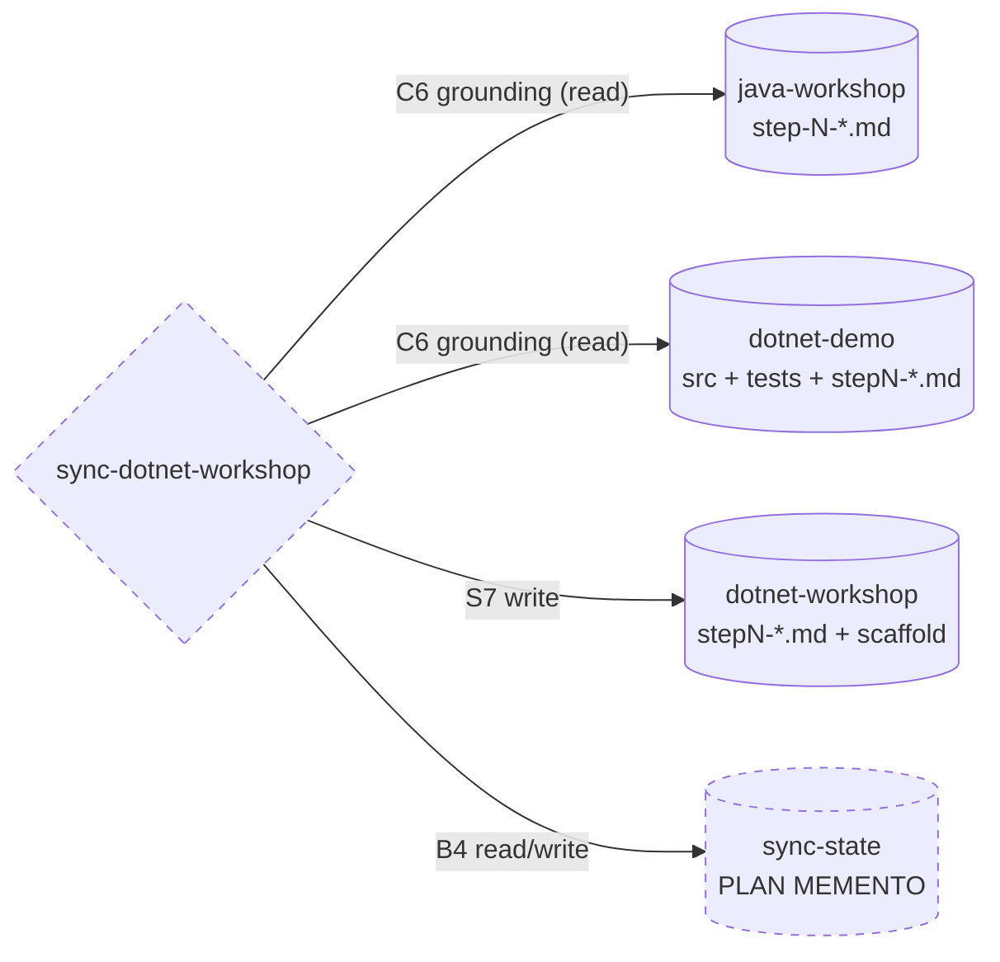
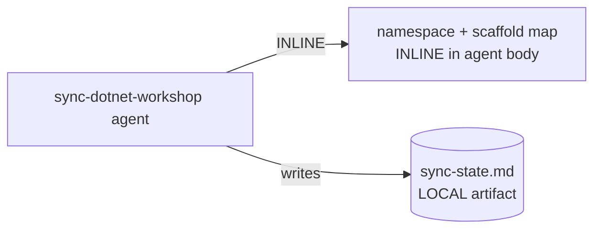

# Genesis handoff packet -- sync-dotnet-workshop

Design artifact produced by the `genesis` skill. This is the source of
truth for any future refactor of the `sync-dotnet-workshop` agent:
re-run genesis from THIS packet, not from the emitted agent body.

## Step 1 -- intent + scope

Single capability: keep `microcks-testcontainers-dotnet-workshop` (the
TARGET) tracking the narrative of `microcks-testcontainers-java-workshop`
(the NARRATION SOURCE) while emitting .NET code grounded in
`microcks-testcontainers-dotnet-demo` (the CODE SOURCE OF TRUTH). The
agent walks the five workshop steps, preserves each step's prose as
close to the Java original as possible, replaces / adds Java code blocks
with copy-paste-ready C# blocks (namespaces included), and leaves a
functional-but-empty starter solution (working `Program.cs` + empty
folders carrying `.gitkeep`) following the dotnet-demo solution layout.
Re-runnable on demand for drift correction when the Java narration changes.

Boundary (what it does NOT do): does not modify the Java workshop or the
dotnet-demo; does not implement the full application (the starter stays
empty by design); does not invent C# not present in dotnet-demo.

Dispatch description (FORCED / manually selected agent): see agent
frontmatter. Invocation mode: FORCED (operator selects the agent when
the Java narration changed or the workshop must be (re)generated).

Cost stance: balanced (default). No cap declared.

## Step 2 -- component diagram



Primitive type: PERSONA + embedded ORCHESTRATOR process, realized as a
Copilot custom agent (`.agent.md`). Rationale: the operator wants "un
agent" they can select on demand; Copilot skills cannot bind `tools:`
(needs `read`/`edit`/`search`/`execute`) and Copilot has no documented
child-thread spawn, so the reconciliation loop runs sequentially in one
thread (see per-harness/copilot.md "Capabilities Copilot lacks").

## Step 3 -- thread / sequence diagram

Architectural pattern: **A11 RECONCILIATION LOOP** (queue of 5 step items,
each driven to terminal state under non-determinism, re-runnable for
drift correction), with each item processed by **A9 SUPERVISED EXECUTION**
(plan -> deterministic write -> verify via `dotnet build`/`dotnet test`).
Degraded to single-thread sequential (no Copilot fan-out affordance).

```mermaid
sequenceDiagram
    participant Op as Operator
    participant Ag as sync-dotnet-workshop (single thread)
    participant St as sync-state (B4)
    participant Fs as workspace files (S7)

    Op->>Ag: select agent (FORCED)
    Ag->>St: load / init state table (5 steps)
    loop per step item (1..5), bounded retry
        Ag->>Ag: GROUND (read java step + demo source) [C6]
        Ag->>Ag: PLAN .NET transformation
        Ag->>Fs: EXECUTE write stepN-*.md (+ scaffold on step 1) [S7]
        Ag->>Fs: VERIFY (no leftover Java; dotnet build) [S4]
        Ag->>St: mark item done / record drift baseline
    end
    Ag-->>Op: summary (items synced, build status)
    Note over Ag,St: stop predicate = all items done AND scaffold builds
```

## Step 3.1 -- tradeoff check

A8 ALIGNMENT LOOP vs A11 RECONCILIATION LOOP: the work names a QUEUE of
items (5 steps) each converging, with a cross-item shared sink (the
scaffold, written once). A11 wins (per architectural-patterns.md A8
"SEE ALSO"). No other pattern slot contested.

## Step 3.2 -- cost check

| Module | Role class | Output band | Tool surface | Workflow |
|---|---|---|---|---|
| sync-dotnet-workshop | CODER (multi-file reasoning, grounded code) | L (5 docs + scaffold) | read/edit/search/execute | sequential A11 |

Stance balanced. Single thread, no fan-out -> no B1 multiplier. Cost
projection: S (1 changed step) ~ small; M (re-sync all 5 docs) ~ medium;
L (full regen incl. scaffold + builds) ~ large but one-off / on-demand.
No cap; no halt.

## Step 3.5 -- composition decision



- The narration->C# mapping table and scaffold layout are INLINE in the
  agent body (unique to this module, small, must travel with it).
- The sync-state table is a LOCAL runtime artifact the agent writes
  (PLAN PERSISTENCE), not a shipped sibling.
- No EXTERNAL MODULE required -> step 7b does not load a module-system
  adapter. The three repos are read directly from the multi-root
  workspace.

## Step 4 -- SoC pass

Single responsibility (sync one target workshop). No sibling overlaps
(genesis is a design skill, unrelated trigger). No R1 SPLIT trigger:
docs + scaffold are one coherent deliverable ("make the workshop track
Java"). Consequential side effect (writing files, running build) bridged
via S7 + S4 (not left as LLM prose) -- this is the load-bearing guard.

## Step 5 -- compliance

- C6 EXTERNAL CORPUS GROUNDING is MANDATORY and load-bearing: every C#
  block emitted MUST be traceable to a dotnet-demo source file. Guards
  against the dominant failure mode (hallucinated C# / wrong namespaces),
  which would destroy the "copy-paste to advance" value.
- S4 VALIDATION DECORATOR blocks (not logs): leftover Java token or a
  failing `dotnet build` halts and revises.
- No BLOCKERS open.

## Step 6 -- interface sketch

- name: `sync-dotnet-workshop`
- trigger: operator-selected when Java narration changed or workshop must
  be (re)generated. FORCED.
- inputs: java-workshop `step-*.md`; dotnet-demo `src/`, `tests/`,
  `stepN-*.md`, solution/config files.
- outputs: dotnet-workshop `stepN-*.md` (Java prose preserved, C# blocks
  with namespaces), starter scaffold (functional `Program.cs`, empty
  folders + `.gitkeep`), `sync-state.md`.
- dependencies: none external.

EVALS (informal, operator-run): with-agent vs without-agent on one
changed Java step -> with-agent must produce a C# block whose namespace
matches the demo; without-agent typically hallucinates. Trigger evals:
"resync the dotnet workshop", "the java step 4 changed, reapply" SHOULD
fire; "run the workshop tests", "explain microcks" should NOT.

DESIGN ENDS HERE. Agent body drafted in `sync-dotnet-workshop.agent.md`.
