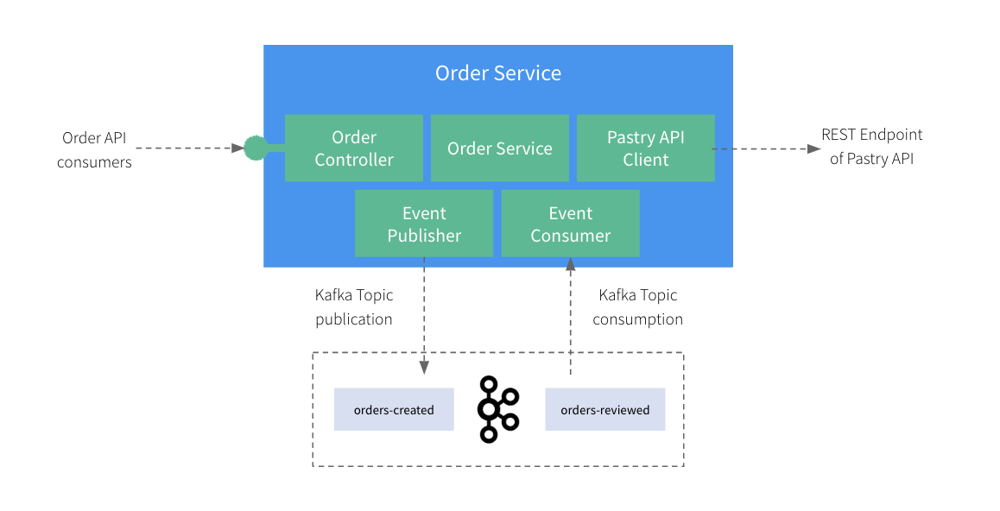

# Microcks Testcontainers ASP.NET Core Workshop

This application is a workshop on how to integrate Microcks via [Testcontainers](https://www.testcontainers.com) within your development inner-loop.

You will work with an ASP.NET Core application and explore how to:
* Use Microcks for **provisioning third-party API mocks**,
* Use Microcks for **simulating external Kafka events publishers**,
* Write tests using Microcks **contract-testing** features for both **REST/OpenAPI based APIs and Events/AsyncAPI** based messaging.

## Table of contents

* [Step 1: Getting Started](step1-getting-started.md)
* [Step 2: Exploring the app](step2-exploring-the-app.md)
* [Step 3: Local Development Experience with Microcks](step3-local-development.md)
* [Step 4: Write Tests for REST](step4-write-rest-tests.md)
* [Step 5: Write Tests for Async](step5-write-async-tests.md)

## License Summary

The code in this repository is made available under the MIT license. See the [LICENSE](LICENSE) file for details.