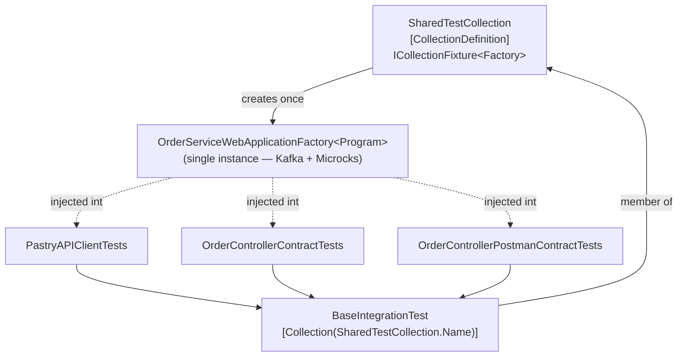

# Sharing Containers Across Test Classes with `SharedTestCollection`

## Why this matters

In [Step 4](step4-write-rest-tests.md), `BaseIntegrationTest` was introduced using xUnit's
`IClassFixture<OrderServiceWebApplicationFactory<Program>>`. With `IClassFixture`, xUnit creates
**one factory instance per test class**. Since our `OrderServiceWebApplicationFactory` boots a Kafka
container and a Microcks container ensemble, that means **every test class would start its own set of
containers**.

This has two consequences:

* **Slow & resource-hungry** — N test classes means N Kafka + N Microcks ensembles started and disposed.
* **A subtle correctness bug** — our factory guards startup with a `static _isInitialized` flag so the
  containers boot only once. xUnit runs test classes **in parallel** by default, so the first class wins
  the race, sets `_isInitialized = true`, and the other classes **skip initialization** — leaving their
  container references `null`. The result is a `NullReferenceException` in `ExposeHostPortsAsync`/
  `InitializeAsync` when you run the **whole** suite at once (running each class in isolation with
  `--filter` still passes, which is exactly what Step 4 prescribes).

The fix is to share **one** factory instance — and therefore **one** set of containers — across **all**
test classes. xUnit provides this through `ICollectionFixture<T>`.

## The `SharedTestCollection` class

```csharp
using Xunit;

namespace Order.Service.Tests;

/// <summary>
/// Collection definition to ensure all integration tests share the same OrderServiceWebApplicationFactory instance.
/// This guarantees that containers are started only once across all test classes.
/// </summary>
[CollectionDefinition(Name)]
public class SharedTestCollection : ICollectionFixture<OrderServiceWebApplicationFactory<Program>>
{
    public const string Name = "SharedTestCollection";
}
```

What each piece does:

* `[CollectionDefinition(Name)]` declares a **named test collection**. Every test class tagged with the
  same name belongs to this collection.
* `ICollectionFixture<OrderServiceWebApplicationFactory<Program>>` tells xUnit to create **a single
  instance** of the factory and inject it into every class in the collection.
* `public const string Name` exposes the collection name as a constant so both the definition and the
  consumers reference the exact same string (no magic literals to keep in sync).

> The class body stays empty on purpose — `CollectionDefinition` classes are never instantiated by your
> code; they only carry the attribute and the fixture interface as metadata for xUnit.

## Wiring `BaseIntegrationTest` to the collection

`BaseIntegrationTest` opts into the shared collection instead of declaring its own per-class fixture:

```csharp
namespace Order.Service.Tests;

[Collection(SharedTestCollection.Name)]
public abstract class BaseIntegrationTest
{
    public WebApplicationFactory<Program> Factory { get; private set; }

    public ushort Port { get; private set; }
    public MicrocksContainerEnsemble MicrocksContainerEnsemble { get; }
    public MicrocksContainer MicrocksContainer => MicrocksContainerEnsemble.MicrocksContainer;
    public KafkaContainer KafkaContainer { get; }
    public HttpClient? HttpClient { get; private set; }

    protected BaseIntegrationTest(OrderServiceWebApplicationFactory<Program> factory)
    {
        Factory = factory;

        HttpClient = this.Factory.CreateClient();
        Port = factory.ActualPort;

        MicrocksContainerEnsemble = factory.MicrocksContainerEnsemble;
        KafkaContainer = factory.KafkaContainer;
    }

    protected void SetupTestOutput(ITestOutputHelper testOutputHelper)
    {
        TestLogger.SetTestOutput(testOutputHelper);
    }
}
```

The differences compared to the `IClassFixture` version from Step 4:

| Step 4 (`IClassFixture`)                                  | Shared collection (`ICollectionFixture`)            |
| -------------------------------------------------------- | --------------------------------------------------- |
| `public class BaseIntegrationTest : IClassFixture<...>`  | `[Collection(SharedTestCollection.Name)]` attribute |
| `public class` (instantiable)                            | `public abstract class` (base only)                 |
| `public` constructor                                     | `protected` constructor                             |
| One factory **per class**                                | One factory **for the whole collection**            |

Because every concrete test class (`PastryAPIClientTests`, `OrderControllerContractTests`,
`OrderControllerPostmanContractTests`, …) inherits from `BaseIntegrationTest`, they all automatically
join the `SharedTestCollection` and receive the **same** factory instance through the constructor — no
extra attribute needed on the individual test classes.

## How xUnit ties it together



1. xUnit discovers the `[CollectionDefinition("SharedTestCollection")]` and reads its
   `ICollectionFixture<OrderServiceWebApplicationFactory<Program>>`.
2. It instantiates the factory **once**, calling `InitializeAsync` (containers boot a single time).
3. Every test class in the collection receives that **same** instance via its constructor.
4. After all classes in the collection finish, xUnit calls `DisposeAsync` **once** to tear the
   containers down.

## Trade-offs

✅ **Advantages**

* Containers start **once** for the entire assembly — significantly faster suite (~70% in practice).
* Lower memory/CPU footprint (one Kafka + one Microcks ensemble).
* The full `dotnet test` run is green, not just isolated `--filter` runs.

⚠️ **Things to keep in mind**

* Test classes in the same collection **do not run in parallel** with each other. This is usually a fair
  price for sharing expensive containers.
* Tests share state through the containers, so design them to be **order-independent** and to avoid
  relying on data left behind by another test.

## Running the tests

```bash
# Whole suite — now green thanks to the shared collection
dotnet test tests/Order.Service.Tests

# A single class still works exactly as before
dotnet test tests/Order.Service.Tests --filter "FullyQualifiedName~PastryAPIClientTests"
```
